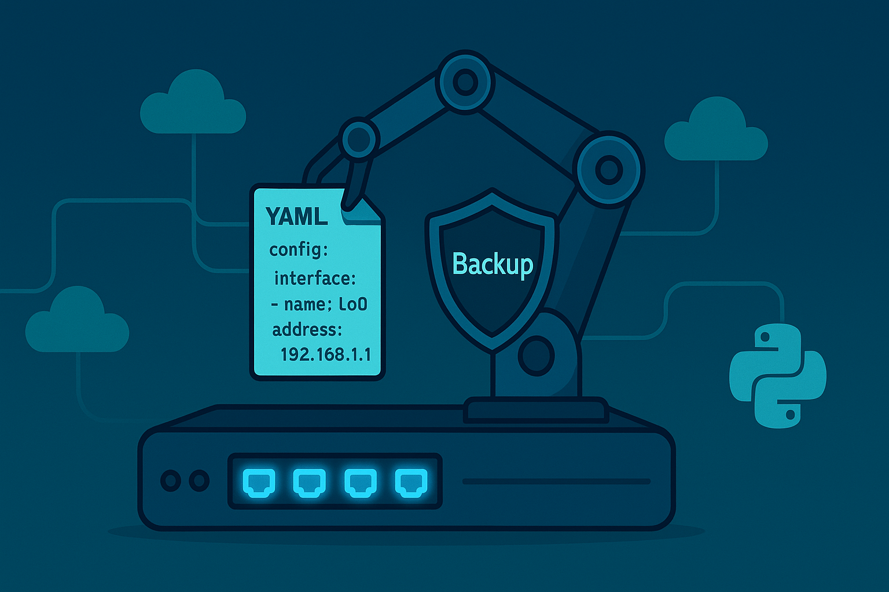

# Cisco Device Configuration Deployment Tool



[](https://github.com/ktbyers/netmiko)

A Python script to automate configuration deployment on Cisco routers and switches using Netmiko. Safely applies configurations while creating backups before making changes.

## Key Features

- 📋 Reads device list and configurations from YAML file
- 💾 Automatic configuration backups before deployment
- ⚡ Applies configuration commands to multiple devices
- 🔐 Securely handles credentials with getpass
- ✅ Automatically saves configurations to startup

## Prerequisites

- Python 3.6+

## Installation

1. Clone the repository:

  ```bash
  git clone https://github.com/masoud-maghsoudi/netmiko-config-manager.git
  cd netmiko-config-manager
  ```

2. Install dependencies using requirements.txt:

  ```bash
  pip install -r requirements.txt
  ```

## Configuration Setup

Create a `config.yml` file in the project root with this structure:

```yaml
device_list:
  - 192.168.1.1
  - 192.168.1.2
  - 192.168.1.3

configs:
  - interface GigabitEthernet0/1
  - description Uplink to Core
  - no shutdown
  - exit
```

## Usage

1. Run the script:

  ```bash
  python deploy_configs.py
  ```

2. You'll see this warning banner:

  ```text
  ###############################################################################
  #                                                                             #
  #     NOTICE: You are changing the configration on Cisco devices based on     #
  #        configuration and devices declarted in config.yml file               #
  #                                                                             #
  #      Please do not proceed if you do not know the effects of deplying       #
  #                     configurations you are applying.                        #
  #                                                                             #
  ###############################################################################
  ```

3. Enter your credentials when prompted:

  ```text
  Please enter the username for devices: admin
  Please enter password for devices: 
  ```

## Process Workflow

1. Loads devices and configurations from `config.yml`
2. Creates timestamped backup of current running config
3. Applies all configurations sequentially
4. Saves configuration to startup
5. Outputs results to console

## Backup Files

Configuration backups are stored in `/config_backup_files` with filename format:

```text
YYYY-MM-DD-HH-MM-SS-<device_ip>-backup.config
```

## Security Notes

- Passwords are hidden during input
- Never commit actual credentials to repository
- Backups contain sensitive device configurations - handle securely
- Use SSH keys instead of passwords in production environments
- **Important**: Add `config.yml` and `config_backup_files/` to your `.gitignore`

## Error Handling

The script handles:

- Connection errors
- Authentication failures
- Netmiko read timeouts
- YAML parsing errors
- File system errors

## Project Structure

```text
cisco-config-deployer/
├── config_backup_files/      # Auto-created backup directory
├── deploy_configs.py         # Main script
├── requirements.txt          # Python dependencies
├── config.yml                # Configuration file (add to .gitignore)
└── README.md                 # This documentation
```

## Contributing

Pull requests are welcome. For major changes, please open an issue first to discuss proposed changes.

## License

[MIT](https://choosealicense.com/licenses/mit/)

## Author Information

| Author | Masoud Maghsoudi                      |
| ------ | ------------------------------------- |
| Email  | <masoud_maghsopudi@yahoo.com>         |
| Github | <https://github.com/masoud-maghsoudi> |
